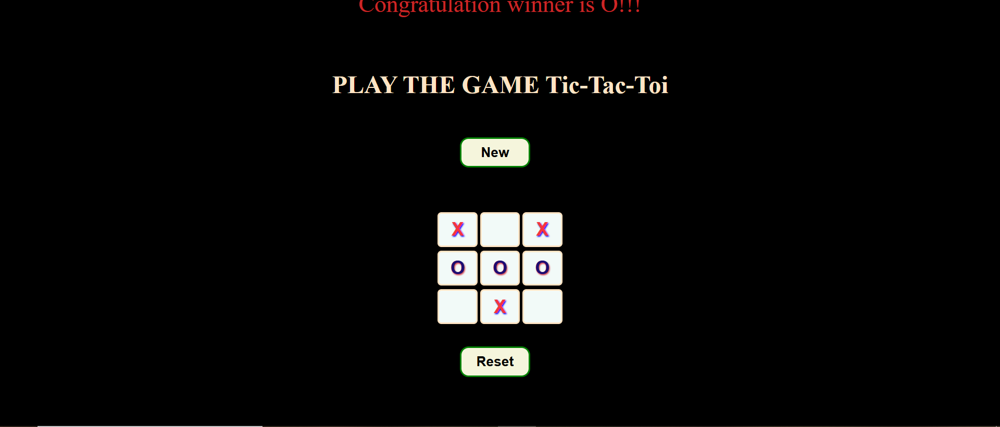
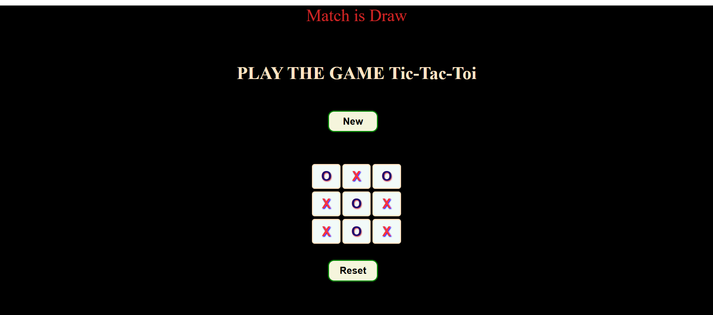

## Tic-Tac-Toe Game 🎮

This project is a simple and interactive Tic-Tac-Toe game built using **HTML**, **CSS**, and **JavaScript**. The game allows two players to play and displays results dynamically based on the outcome of the game.

## Features ✨

- **Interactive Gameplay**: Classic Tic-Tac-Toe game that can be played directly in the browser.
- **Dynamic Result Display**:
  - Declares "Congratulations O Wins!" when player O wins.
  - Declares "Congratulations X Wins!" when player X wins.
  - Displays "Match is Draw!" when there is no winner.
- **Responsive Design**: Adapts to different screen sizes and devices.

## How to Play 🎲

1. Two players alternate turns to place their symbols (X or O) on the 3x3 grid.
2. The first player to get three of their symbols in a row, column, or diagonal wins.
3. If the grid is filled without a winner, the game ends in a draw.

## Technologies Used 🛠️

- **HTML**: For the structure of the web page.
- **CSS**: For styling and layout design.
- **JavaScript**: For implementing the game logic and interactivity.

## How to Use 🛠️

1. Download or clone the repository to your local machine.
2. Open the `index.html` file in any modern web browser.
3. Start playing the game with a friend!

